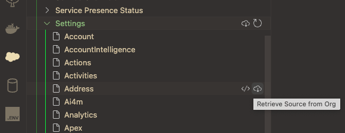

# pryfile.js

[](https://www.npmjs.org/package/st-state-parser)

## Installation

### Dependencies

- Node.js (verify by running `node -v`)
- an SFDX project

### Setup

Install with npm

```bash
  npm i -g sf-state-parser
```

## Usage

sf-state-parser is to be used from within an SFDX project directory. It's easiest to open a project in VS Code, then open the embedded terminal (`ctr`/`cmd`+`j`).

### Download State and Country/Territory Picklist data

Use the sfdx CLI or Org Browser in VS Code to get your picklist data.
> You will need to have the CLI or a VS Code project already authenticated with the org you want to get data from!

#### Option #1: CLI

Run the following in the terminal from within your sfdx project:

```bash
    sf project retrieve start -m Settings:Address
```

#### Option #2: Org Browser

Use the Org Browser tab in VS Code to retrieve "Address" from Settings.



You should now have the file `Address.settings-meta.xml` in `force-app/main/default/Settings`

### Run it

Run the following command in your terminal:

```bash
    sf-state
```

It will create two CSV files in the folder `sf-state`: `states.csv` and `countries.csv`. You can import them into Excel from here.
